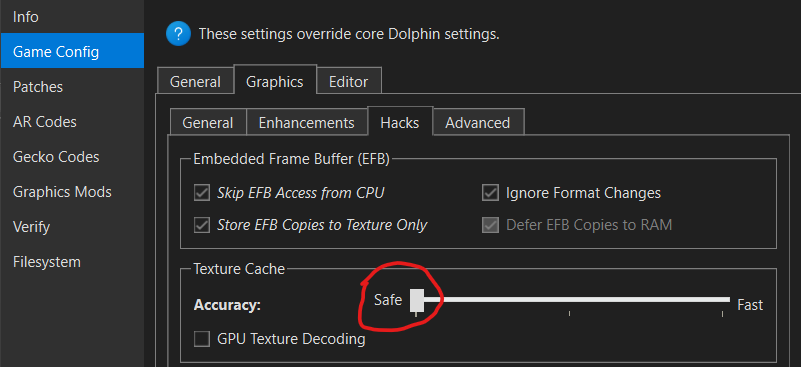

# A romhack for Super Mario Sunshine practice

It adds emulator-like savestates to console (Wii through Nintendont) and is compatible with many existing speedrun gecko codes. Vibe coded software, use at your own risk.

It exploits the fact that the Wii has a considerable amount of RAM free when running a Gamecube game through Nintendont, to snapshot more or less the entire state of the game. This lets you save and restore basically anywhere, any time within the same stage/area (including during a cutscene, shine get or death animation, etc.).

## Usage + Caveats

D-pad left to save, d-pad right to load. If you have the position/red coin/timer/etc. savestate gecko codes on it will technically run both but these savestates will take precedence. 

* JP 1.0 (GMSJ01), US (GMSE01), and PAL (GMSP01) are supported. Builds and
  launchers must match the disc's region.
* You can only save and load from within the same area (the buttons do nothing if there is no savestate or if it belongs to a different area). It uses a pretty strict definition as to what is a different area, for example airstrip before and after collecting FLUDD are different areas. Going to another stage doesn't get rid of your savestate. 
* Loading from a savestate breaks the music and may mess with the audio in other ways, but generally speaking the sound effects still work. In some cases, FLUDD sounds break, like when loading after collecting a shine. Reloading the level should restore the music and sound effects though.
* Saving and loading during stage intro cutscenes works but seems a bit flaky, especially when using a real disc.

## Installation

### Console (wii)

Download the launcher zip for your region from the Releases page. Extract it to your `apps/` folder on your SD card, so that you have a region-matched folder such as `apps:/susamune_launcher_us/{boot.dol,meta.xml,icon.png}`. By default, the launcher is configured to load from a real disc. If you want to load your game from SD card or USB instead, follow the instructions in the comments in `meta.xml` to change the boot path to your ISO.

To launch your game, simply go to the homebrew channel and run the susamune launcher app that should appear. Your gecko codes should work out of the box if you are already using Nintendont for practice. The code file must match the disc, such as `codes/GMSJ01.gct` (JP), `codes/GMSE01.gct` (US), or `codes/GMSP01.gct` (PAL).

### Emulator

Unfortunately, for emulator you currently have to build the patched ISO yourself. Only windows is supported for building. You will need CMake and Python in PATH. Place the source ISO at the repo root as `GMSJ01.iso`, `GMSE01.iso`, or `GMSP01.iso` (or pass its path with `-DSMS_ISO`).

In the root of the repo, first install the virtualenv with:

```
python setup_venv.py
```

Then configure with:

```
cmake --preset savestates_emu
```

Then build with:

```
cmake --build preset emu_iso
```

The ISO appears as `build/susamune_<version>.iso`. To build US or PAL, add
`-DVERS=us` or `-DVERS=pal` when configuring CMake.

> [!IMPORTANT]
> Saving and loading the goop is broken in Dolphin unless 'Texture Cache Accuracy' it set to Safe. You can find this option in the 'Hacks' tab of 'Graphics' in the game's config:
> 
> It says it degrades performance although on my machine it seems to run fine still. YMMV.

In case you would like to maintain a different set of gecko codes for this practice rom and the standard ROM, or different in-game settings (for example if you would like to keep texture cache accuracy on fast for the standard ROM), you can instead configure with:

```
cmake --preset savestates_emu -DUPDATE_ISO_METADATA=ON
```

and build as before. This will produce an iso with game code GMSJ02 instead of GMSJ01, which will have a different settings file in Dolphin that can have its own cheats and etc.

## Credits

- https://github.com/DotKuribo/BetterSunshineEngine/
    - Used heavily as reference. Clang fork with CodeWarrior ABI support used to compile mod (toolchain/)
- https://github.com/DotKuribo/SunshineHeaderInterface
    - THANK YOU FOR WRITING THIS
- https://github.com/SuperrSonic/Better-Nintendont
    - Nintendont fork used as base for the launcher in this repo
- https://github.com/doldecomp/sms
    - Used for Claude to know how everything works

## FAQ (Frequently Anticipated Questions) 

### Does it support Gamecube?

No.

### Why isn't this a Gecko code?

Because:

* On console, it relies on a specific memory layout of Nintendont to facilitate the savestates feature. Depending on your settings, version of Nintendont, or if you are using a fork, the savestate buffer might overlap with other things like the disc cache or emulated memory card, and you will get crashes. I am therefore distributing a fork of nintendont that has these things locked down.
* It's not very optimized in terms of code size, and using dol_c_kit I get a code that is a larger than a lot of loaders will accept AFAIK (660 lines). This number seems quite bloated so I think it's just a compilation problem. Theoretically it should be easy to fashion into a gecko code. 
* I might add other features in the future that might exceed the limits of what is reasaonble in a gecko code so I would like to not rely on them.

### What regions/versions are supported?

JP 1.0 (GMSJ01), US (GMSE01), and PAL (GMSP01) are supported. Select the
target with `-DVERS=jp`, `-DVERS=us`, or `-DVERS=pal` at configure time.
