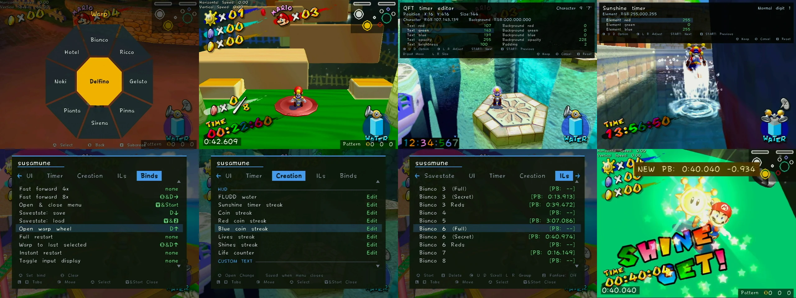

# A romhack for Super Mario Sunshine practice

It implements most of the [GCT generator](https://gct.zint.ch/) practice codes, adds emulator-like savestates to console (Wii through Nintendont), and more. It supports JP 1.0, US, and PAL versions.

  

Features:
- An emulator like savestate on Wii.
- Virtually all gecko codes integrated into the main launcher.
    - Integrated Timer, Metadata, Input display, Level select, Warp wheel and much more.
- In-game settings menu configuration for codes, persistent and stored on SD card (wii) / slot B memory card (emulator).
- Configurable button binds.
- Configurable GUI elements (text, position, color, size for timer, metadata display, pattern selector, vanilla HUD elements etc.)
- A brand new integrated IL system.
    - Saves your PB per level.
    - Plays you a little victory fanfare when you PB.
    - Has Any% plaza segments built in Faithfully to how they appear in the run.
    - In the future you will be able to toggle between profiles for categories. I.e 'Any%', '120', '96', ETC.
    - IL menu functions as built in warp list.
- Automatic memory card encoding based on version launched.
- And much more.

> [!WARNING]
> While the mod will generally boot with the GCT generator practice codes installed, and supports Gecko codes in principle, we strongly advise against loading the mod with Gecko codes enabled, as they will either break or be broken by Susamune's features. For example, 'Level Select' is known to cause Susamune's instant restart to break in unpredictable/nondeterministic ways.

## Installation

### Console (wii)

Download the launcher zip from the Releases page, and extract it to your `apps/` folder on your SD card, so that you have `apps:/susamune_launcher/{boot.dol,meta.xml,icon.png,mod_jp.bin,mod_us.bin,mod_pal.bin}`. You can then launch from the "Susamune Launcher" channel on the Homebrew Channel. It will load into a GUI that lets you select which region game you want to boot from (with configurable paths for each: SD, USB,  real disc), and configure some standard Nintendont options like progressive setting, PAL language, etc. 

Settings and binds are stored per region in `susamune.ini` at the root of the SD card, in `[settings_jp]` / `[binds_jp]` sections and their `us` / `pal` counterparts.

### Emulator

Download the BPS for your region from the Releases page and apply it to a clean
ISO with a BPS patcher such as
[Floating IPS](https://github.com/Alcaro/Flips/releases). The patch verifies
the source image before writing the Susamune ISO.

| Region | Patch | Clean CRC32 | Clean MD5 |
| --- | --- | --- | --- |
| JP 1.0 (`GMSJ01`) | `susamune_jp.bps` | `C3B17583` | `3B07A4BB22DB926B177E207F9D7F0D87` |
| US (`GMSE01`) | `susamune_us.bps` | `771AD977` | `0C6D2EDAE9FDF40DFC410FF1623E4119` |
| PAL (`GMSP01`) | `susamune_pal.bps` | `4C1D3641` | `72C4860D8555D5E790628E348ABC244D` |

> [!IMPORTANT]
> Saving and loading the goop with savestates is broken in Dolphin unless 'Texture Cache Accuracy' it set to Safe. You can find this option in the 'Hacks' tab of 'Graphics' in the game's config:
> 
> It says it degrades performance although on my machine it seems to run fine still. YMMV.

> [!IMPORTANT]
> For settings persistence to work, make sure you have a memory card in slot B.

## Credits

- https://gct.zint.ch/ and all its authors - Psychonauter, Noki Doki, sup39, Milk. 
    - Disassembled gecko codes were used to implement the practice features ported from these codes. 
    - Also used the assembly source at https://forgejo.sup39.dev/sms/supSMS-GeckoCode by sup39 as reference.
- https://github.com/DotKuribo/BetterSunshineEngine/
    - Used heavily as reference. Clang fork with CodeWarrior ABI support used to compile mod (toolchain/)
- https://github.com/DotKuribo/SunshineHeaderInterface
    - THANK YOU FOR WRITING THIS
- https://github.com/SuperrSonic/Better-Nintendont
    - Nintendont fork used as base for the launcher in this repo
- https://github.com/doldecomp/sms
    - fed to the LLMs to know how everything works

## FAQ (Frequently Anticipated Questions) 

### How do the savestates work? 

It exploits the fact that the Wii has a considerable amount of RAM free when running a Gamecube game through Nintendont, to snapshot more or less the entire state of the game. This lets you save and restore basically anywhere, any time within the same stage/area (including during a cutscene, shine get or death animation, etc.).

### Does it support Gamecube?

No.
